# InterPlanetary File System (IPFS)

A peer-to-peer hypermedia protocol designed to preserve and grow humanity's knowledge by making the web upgradeable, resilient, and more open.

## Initial Setup
It is **highly recommended** to use IPFS over LAN, especially when dealing with large files or file sets.  It will work fine over tor for basic use and management.  To use over tor, substitute your onion addresses for LAN addresses in the steps below.

For setup, you need to access your node via LAN (`.local` address). If you have
not already,
[please set up LAN access](https://start9.com/latest/user-manual/connecting/connecting-lan/lan-os/index)
for your client device and
[browser](https://start9.com/latest/user-manual/connecting/connecting-lan/lan-browser/index).

1. After install, click "Configure," and then click "Save," as this service has
   no needed configurations at this time.
1. Click "Start" to launch your node. After the Health Check shows the UI is
   available (in green), use the following direction to setup the browser
   extension.

## IPFS Companion Browser Extension

The easiest way to interact with your IPFS node while you are on the web is via
the [IPFS Companion](https://docs.ipfs.io/install/ipfs-companion/) browser
extenion.

1. Install the Companion to your browser using the link above and selecting your
   browser (Firefox or Chrome-based). You can click through any pop-up warnings.
1. Once installed, click on the extension's icon in your browser toolbar . It
   will look like a gray cube. Then click the gear icon to enter the Settings.

   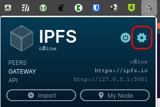

   - On the resulting page, scroll to the second section, and under API > IPFS
     API URL, add your API LAN address from your Embassy UI's IPFS service
     page > Interfaces > API (copy icon). You will replace everything on that
     line and your address will begin with `https://`. No port is needed

   - Under Gateways > Default Public Gateway, you will add your IPFS Gateway LAN
     address from the "Interfaces" section of your IPFS service page.
   - Finally, uncheck the option for "Use Local Gateway."  The result will be as below:
   
   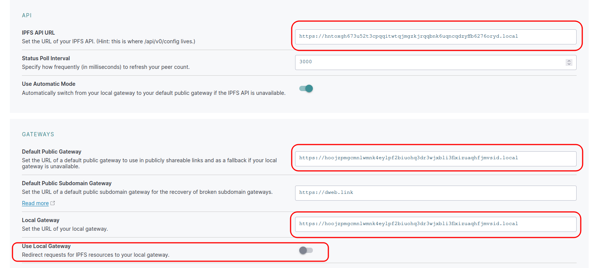

1. Next, go back to the Companion Extension and click "My Node" to enter your IPFS WebUI.

   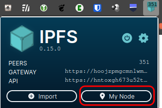

   - Click "Settings" on the bottom of the left-hand menu.

   - Similar to above, copy-paste in the API and Gateway LAN addresses from your Embassy's IPFS Service Interfaces page into the appropriate fields.

   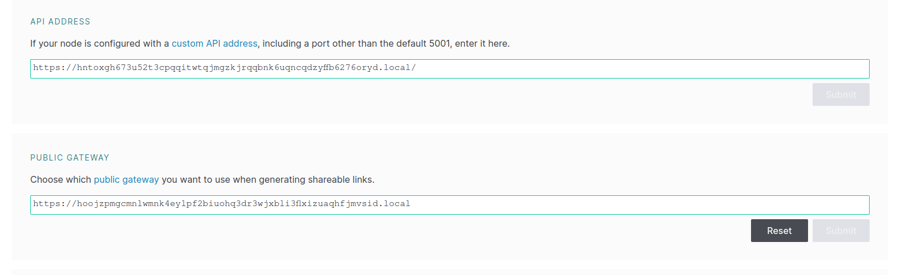

1. That's it! You will notice that your browser extension has turned teal in
   color, and is displaying a number of connected peers. Click "Status" at the top of the left-hand menu for details on your node.

## Basic Use
### Add a Peer
1. Click "Peers" in the left-hand menu.

   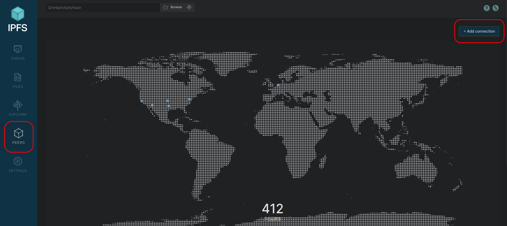

1. Click "Add Connection" in the top left

   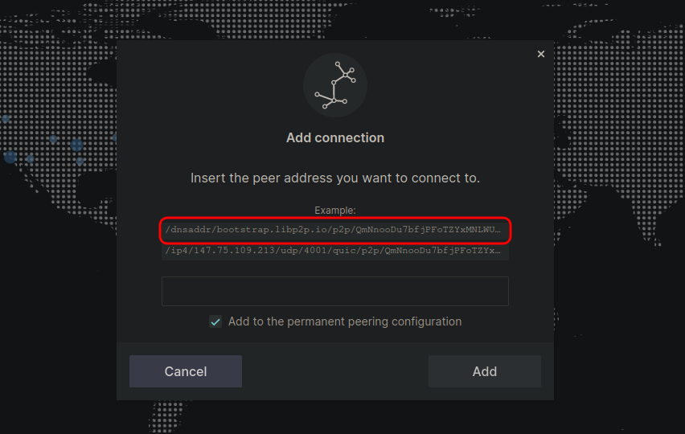

1. In the resulting window, you can add your Peer if you have its full location, or if you only have the peer id, copy paste a bootstrap node address and delete the peer id from the end (everything after `/p2p/`).

   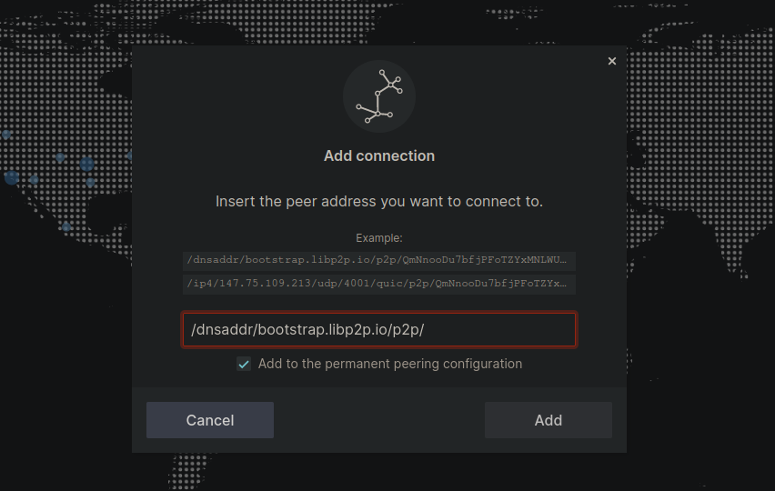

1. Finally, paste in the Peer ID and hit "Add"

   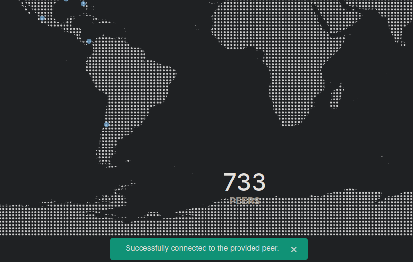

1. You will get a success message at the very bottom of the page as shown above.

### Add and Pin a File
1. Click "Files" in the left-hand menu, and then "+Import" in the top-right of the Files tab.

   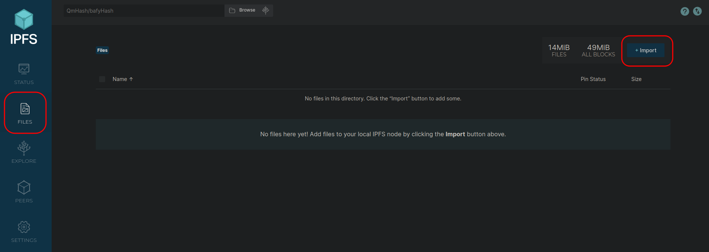

1. In this example, we'll just add a single file, so click "File," then select a file from your local device.

   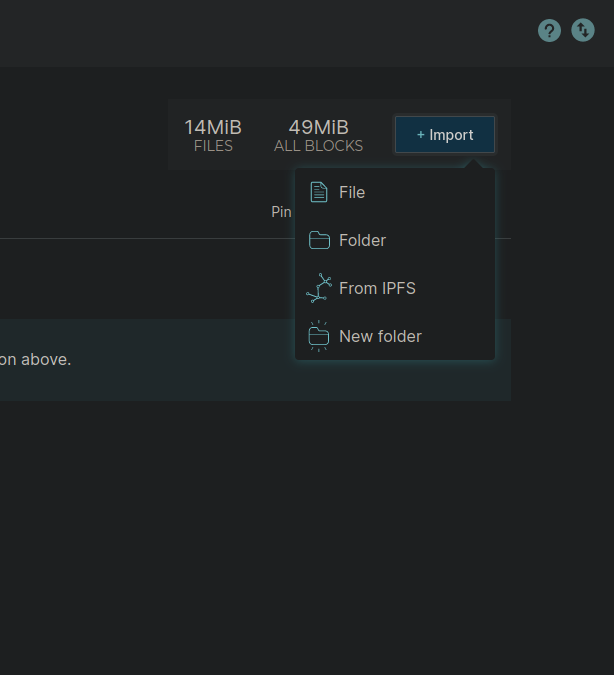

1. Your file will be added, giving it a CID (Content Identifier).  This is now hash-addressed content, suitable for use on IPFS.

1. Next we want to actually host the file on the network, so we will "pin" it, by clicking the kebab menu to the right of the file.  Click "Set pinning."

   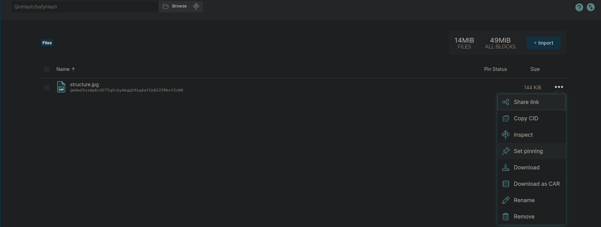

1. Check the box to pin to your "Local node" (your Embassy IPFS node), and you're done.  Others can now access your file by its CID.

   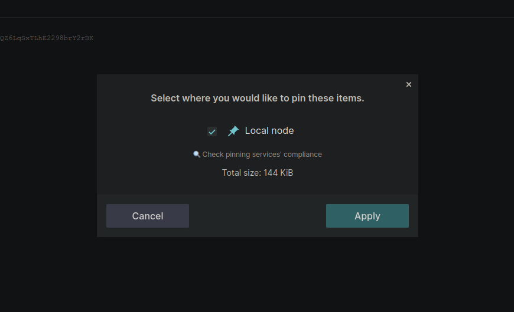

### Search for Data by CID
1. Paste a CID into the search box at the top of your node's WebUI.

   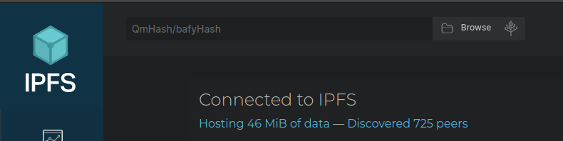

1. If not previewed, click "public gateway," and you will be taken to the file on the IPFS network!

   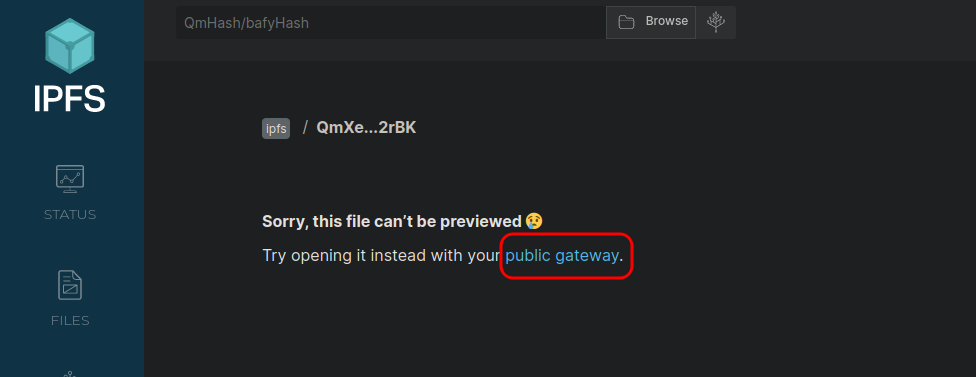